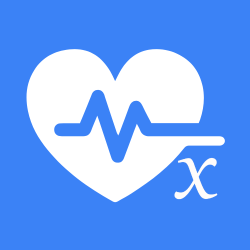
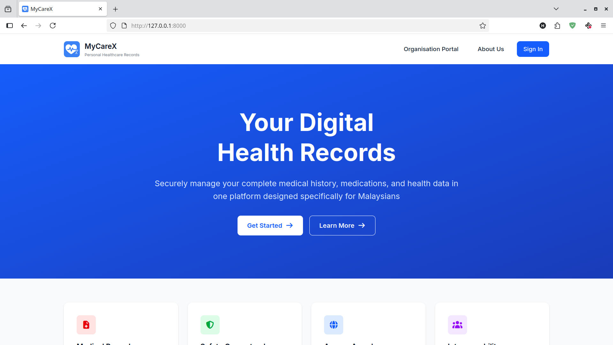
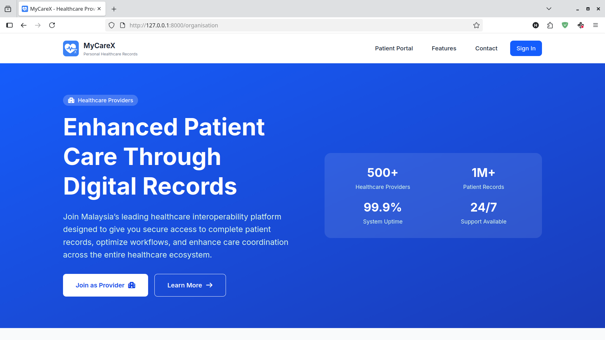

<div align="center">



# MyCareX

### Personal Healthcare Records Management System

*A patient-centric health data platform solving interoperability challenges in Malaysia's healthcare system*


**🎓 Final Year Project | Computer Science Degree | UMS**

[Demo](#-screenshots) • [Features](#-features) • [Installation](#-installation) • [Tech Stack](#-tech-stack)

</div>

---

## 📋 Overview

**MyCareX** is a centralized personal health records (PHR) management system that empowers patients to own and control their medical data. Designed specifically for Malaysia's healthcare ecosystem, it addresses critical challenges in healthcare data interoperability, cost accessibility, and patient privacy.

### 🎯 The Problem It Solves

- **🔗 Interoperability Crisis** – Healthcare providers in Malaysia operate in silos with incompatible systems
- **💰 Data Access Costs** – Patients often pay fees to retrieve their own medical records from providers
- **⚠️ Medical Errors** – Incomplete patient history when switching providers leads to treatment mistakes
- **🔒 Privacy Concerns** – Patients have minimal control over who accesses their sensitive health data

### ✨ The Solution

MyCareX puts **patients in control**. All health data is stored in a centralized system where:
- Patients decide which providers can access their records
- Every data modification is tracked and auditable
- Providers with granted access can manage records, but all actions are logged
- Complete medical history travels with the patient across different healthcare facilities

---

## 🚀 Features

### For Patients
- ✅ **Centralized Health Records** – Store complete medical history, medications, lab results, and prescriptions in one place
- 🔐 **Granular Access Control** – Approve or revoke provider access to your data at any time
- 📊 **Audit Logging** – See who accessed or modified your records and when
- 🌐 **Secure Data Sharing** – Share records with any registered healthcare provider in Malaysia
- 📱 **24/7 Accessibility** – Access your health data anytime, anywhere

### For Healthcare Providers
- 🏥 **Complete Patient History** – Access comprehensive medical records (with patient consent)
- 📝 **Data Management** – Update patient records, add diagnoses, prescriptions, and test results
- 🔍 **Transparent Actions** – All modifications are tracked for accountability
- 🤝 **Better Care Coordination** – Avoid duplicate tests and medication errors with full patient context

### System Features
- 🔒 **Role-Based Access Control (RBAC)** – Separate portals for patients and healthcare organizations
- 📈 **Activity Tracking** – Complete audit trail of all data access and modifications
- 🛡️ **Security First** – Built with healthcare data privacy standards in mind
- 🇲🇾 **Malaysia-Focused** – Designed for local healthcare infrastructure and practices

---

## 📸 Screenshots

### Patient Portal


*Patients can securely manage their health data and control provider access*

### Healthcare Provider Portal


*Providers can access patient records (with permission) and enhance care coordination*

---

## 🛠️ Tech Stack

| Layer | Technologies |
|-------|-------------|
| **Backend** | PHP 8.2, Laravel 12 |
| **Frontend** | Blade Templates (67.1%), JavaScript (12.1%), CSS (0.1%) |
| **Database** | MySQL |
| **Tools** | Composer, NPM, Laravel Tinker, PHPUnit |
| **Dev Environment** | Laravel Sail (Docker) |

---

## 📦 Installation

### Prerequisites
- PHP >= 8.2
- Composer
- MySQL
- Node.js & NPM

### Setup Steps

1. **Clone the repository**
   ```bash
   git clone https://github.com/mohammadhafiizzz/MyCareX-App.git
   cd MyCareX-App
   ```

2. **Install dependencies**
   ```bash
   composer install
   npm install
   ```

3. **Environment configuration**
   ```bash
   cp .env.example .env
   php artisan key:generate
   ```

4. **Configure database**
   - Create a MySQL database
   - Update `.env` with your database credentials:
     ```env
     DB_CONNECTION=mysql
     DB_HOST=127.0.0.1
     DB_PORT=3306
     DB_DATABASE=mycarex
     DB_USERNAME=your_username
     DB_PASSWORD=your_password
     ```

5. **Run migrations**
   ```bash
   php artisan migrate
   ```

6. **Seed the database (optional)**
   ```bash
   php artisan db:seed
   ```

7. **Build frontend assets**
   ```bash
   npm run dev
   ```

8. **Start the development server**
   ```bash
   php artisan serve
   ```

9. **Access the application**
   - Patient Portal: `http://127.0.0.1:8000`
   - Provider Portal: `http://127.0.0.1:8000/organisation`

---

## 🎓 Academic Context

This project was developed as a **Final Year Project (FYP)** for a Computer Science degree at **Universiti Malaysia Sabah (UMS)**. It represents an academic prototype demonstrating:

- Full-stack web application development
- Healthcare data management systems
- User authentication and authorization
- Database design and normalization
- Software engineering best practices
- Real-world problem-solving in the Malaysian healthcare context

**Note:** This is an academic prototype built for demonstration and research purposes.

---

## 🏗️ Project Structure

```
MyCareX-App/
├── app/
│   ├── Http/Controllers/    # Request handlers
│   ├── Models/               # Eloquent models
│   └── ...
├── database/
│   ├── migrations/           # Database schema
│   └── seeders/              # Test data
├── resources/
│   ├── views/                # Blade templates
│   ├── js/                   # JavaScript files
│   └── css/                  # Stylesheets
├── routes/
│   └── web.php               # Application routes
├── public/                   # Public assets
└── screenshots/              # Application screenshots
```

---

## 🔑 Key Functionalities

- **User Authentication** – Secure login for patients and healthcare providers
- **Access Request System** – Providers request access, patients approve/deny
- **Medical Records CRUD** – Create, read, update, delete health records
- **Audit Trail** – Complete history of all data access and modifications
- **Role Management** – Patient vs. Provider permissions and capabilities
- **Data Privacy Controls** – Granular permissions for sharing specific records

---

## 🌟 Future Enhancements

- [ ] Mobile application (iOS/Android)
- [ ] Integration with government health databases
- [ ] AI-powered health insights and recommendations
- [ ] Appointment scheduling system
- [ ] Telemedicine integration
- [ ] Multi-language support (Malay, English, Chinese, Tamil)
- [ ] PDF report generation for medical records
- [ ] Emergency access protocols for critical care situations

---

## 🤝 Contributing

This is an academic project, but feedback and suggestions are welcome!

1. Fork the repository
2. Create a feature branch (`git checkout -b feature/improvement`)
3. Commit your changes (`git commit -m 'Add some improvement'`)
4. Push to the branch (`git push origin feature/improvement`)
5. Open a Pull Request

---

## 👨‍💻 Developer

**Mohammad Hafiz**  
Computer Science Student | UMS

[](https://www.linkedin.com/in/hafiz-mohan-447590255)
[](https://github.com/mohammadhafiizzz)

---

<div align="center">

**Built with ❤️ for better healthcare in Malaysia**

*Empowering patients, connecting providers, improving care*

</div>
